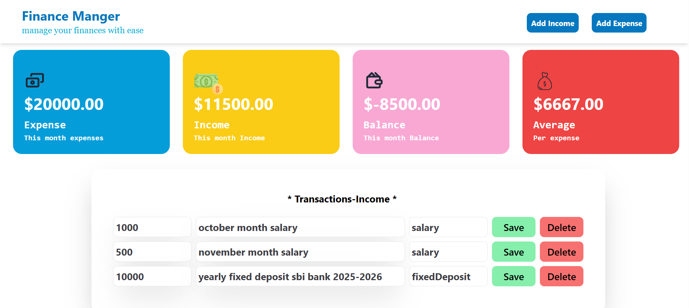
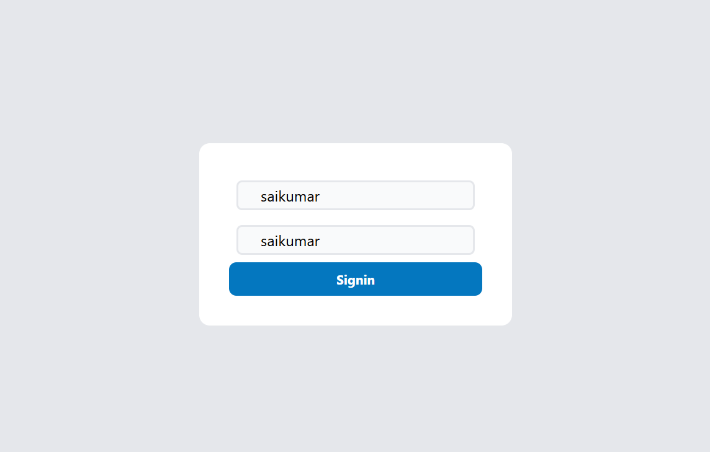
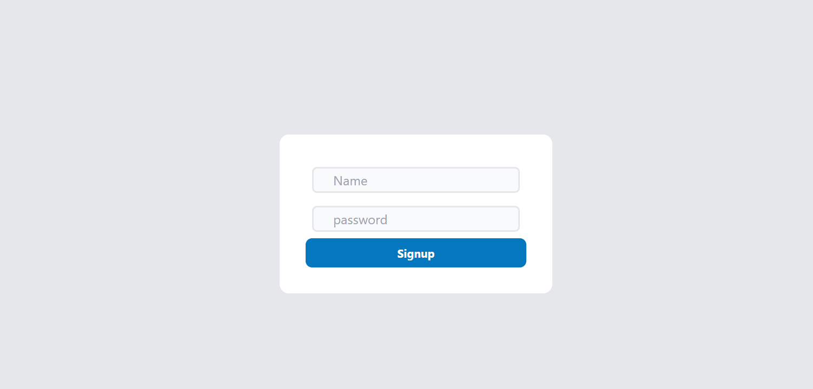
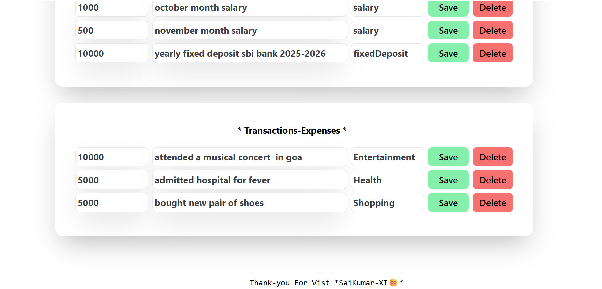
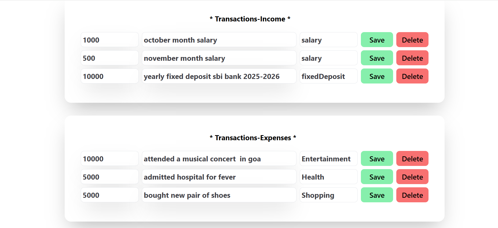

# 💰 Finance Manager App

A full-stack **personal finance management application** that helps users track income and expenses, calculate balance and averages, and visualize transactions in a clean dashboard.

Built with:
- 🧠 **React (Vite + TypeScript)** frontend  
- ⚙️ **Node.js + Express + MongoDB + JWT** backend  
- 🎨 **Tailwind CSS** for styling

---

## 📸 Screenshots

### 🏠 Home Page


### 🔐 Sign In Page


### 📝 Sign Up Page


### 🔄 Transition View


### 💳 Transactions Overview


---

## 🗂 Folder Structure

    project-root/
│
├── assets/
│ ├── home.png
│ ├── signin.png
│ ├── signup.png
│ ├── transition2.png
│ └── trasactions.png
│
├── frontend/
│ ├── src/
│ │ ├── hooks/
│ │ │ └── incomeHook.tsx
│ │ ├── icons/
│ │ │ ├── AverageSpentIcon.tsx
│ │ │ ├── Balance.tsx
│ │ │ ├── ExpensesIcon.tsx
│ │ │ ├── IncomeIcon.tsx
│ │ │ └── shareIcon.tsx
│ │ ├── pages/
│ │ │ ├── dashBoard.tsx
│ │ │ ├── signinPage.tsx
│ │ │ └── signupPage.tsx
│ │ ├── utils/
│ │ │ ├── expensesAdd.tsx
│ │ │ └── incomeAdd.tsx
│ │ ├── App.tsx
│ │ ├── main.tsx
│ │ └── index.css
│ ├── tailwind.config.js
│ ├── vite.config.ts
│ └── tsconfig.json
│
├── backend/
│ ├── src/
│ │ ├── routes/
│ │ │ └── userRouter.js ← your Express routes (signup, signin, income, expenses)
│ │ ├── db.js
│ │ ├── config.js
│ │ └── middleware.js
│ ├── package.json
│ ├── tsconfig.json
│ └── dist/
│
└── README.md


---

## 🚀 Features

### 🧍 User Authentication
- **Signup** and **Signin** with JWT-based authorization.

### 💵 Income & Expense Management
- Add, update, and delete **income** or **expense** entries.
- Each user’s data is private and secured via JWT tokens.

### 💹 Dashboard Insights
- Real-time calculations for:
  - **Total Income**
  - **Total Expenses**
  - **Current Balance**
  - **Average Spend per Expense**

### 🔁 Live Refresh
- Automatically updates dashboard after every add, edit, or delete action.

---

## 🧠 Tech Stack

### 🖥️ Frontend
- React + TypeScript + Vite
- Tailwind CSS
- Custom Hooks & Reusable Components

### ⚙️ Backend
- Node.js + Express
- MongoDB + Mongoose
- JWT Authentication

---

## 🛠️ Setup Instructions

### 📦 1. Clone the Repository
```bash
git clone https://github.com/yourusername/finance-manager.git
cd finance-manager

💻 2. Frontend Setup
cd frontend
npm install
npm run dev


The app will start at http://localhost:5173

⚙️ 3. Backend Setup
cd backend
npm install
npm run start


The server will start at http://localhost:5000

🔑 4. Environment Variables

Create a .env file inside the backend/ folder:

MONGO_URL = your_mongodb_connection_string
JWT_SECRET_KEY = your_secret_key
PORT = 5000

📡 API Endpoints
👤 User Authentication
Method	Endpoint	Description
POST	/signup	Create a new user
POST	/signin	Login and get JWT token
💸 Income
Method	Endpoint	Description
POST	/income	Add new income
GET	/income	Fetch all income
PUT	/income	Update income records
DELETE	/income	Delete an income record
🧾 Expenses
Method	Endpoint	Description
POST	/expenses	Add new expense
GET	/expenses	Fetch all expenses
PUT	/expenses	Update expense records
DELETE	/expenses	Delete an expense record
📊 Dashboard Preview

The dashboard displays:

💰 Income

💸 Expenses

💵 Balance

📈 Average Spend per Expense

Each value updates dynamically using React’s useEffect() hooks.

🙌 Acknowledgement

Developed by Sai Kumar XT
“Manage your finances with ease.” 🧾💡

🧾 License

This project is open source and available under the MIT License
.